# Automated Seismic First Break Picking

[](https://github.com/Rufiz16980/seismic-first-break-picking/blob/main/LICENSE)   
*A Deep Learning Pipeline for Hard-Rock Seismic Exploration*

Automated seismic first-break picking is the task of marking, for every receiver trace in a seismic survey, the earliest physically meaningful arrival of wave energy. In mining geophysics this is a foundational preprocessing step: if the first breaks are wrong, static corrections, near-surface velocity estimates, and ultimately the deeper image of the subsurface are all degraded.

This repository documents an end-to-end machine learning workflow built on the four public HardPicks hard-rock surveys: Brunswick, Halfmile, Lalor, and Sudbury. It starts with raw HDF5 verification, studies the surveys through exploratory data analysis, harmonizes them into a common training format, benchmarks several neural model families, and analyzes why some representations and architectures work better than others. The README focuses on the repository's current internal held-out-split evaluation; the official leave-one-survey-out HardPicks protocol is discussed separately in the evaluation and limitations sections.

---

## Table of Contents

1. [Project Summary](#1-project-summary)
2. [The Scientific Problem](#2-the-scientific-problem)
3. [The HardPicks Datasets](#3-the-hardpicks-datasets)
4. [How 3D Surveys Become 2D Images and 1D Traces](#4-how-3d-surveys-become-2d-images-and-1d-traces)
5. [Related Work and Benchmark Context](#5-related-work-and-benchmark-context)
6. [Data Fields Used by the Pipeline](#6-data-fields-used-by-the-pipeline)
7. [EDA Notebook-by-Notebook Findings](#7-eda-notebook-by-notebook-findings)
8. [What the EDA Changed in the Final Pipeline](#8-what-the-eda-changed-in-the-final-pipeline)
9. [Preprocessing and Transformation Pipeline](#9-preprocessing-and-transformation-pipeline)
10. [Model Families, Expected Behavior, and Architectural Choices](#10-model-families-expected-behavior-and-architectural-choices)
11. [Training Strategy and Infrastructure](#11-training-strategy-and-infrastructure)
12. [Evaluation Protocol and Metrics](#12-evaluation-protocol-and-metrics)
13. [Results on the Current Repository Split](#13-results-on-the-current-repository-split)
14. [Result Analysis and What the Results Mean](#14-result-analysis-and-what-the-results-mean)
15. [Latency Analysis](#15-latency-analysis)
16. [Limitations and Next Steps](#16-limitations-and-next-steps)
17. [Repository Structure](#17-repository-structure)
18. [References](#18-references)

---

## 1. Project Summary

This project is about automating one of the oldest and most repetitive tasks in reflection seismology: deciding, trace by trace, when the very first useful seismic energy reaches each receiver after a source is fired. A human interpreter can do this by visually scanning waveforms and clicking the onset, but modern hard-rock surveys contain millions of traces. That makes manual picking slow, expensive, and inconsistent, especially on noisy or weak traces.

For a reader far from geology, it helps to imagine the survey as follows. A source at the surface sends energy into the ground. Hundreds or thousands of receivers record how the vibration returns through time. Each receiver produces a one-dimensional waveform called a seismic trace. The model's job is to inspect that waveform and predict one number: the first-break time in milliseconds. That predicted time is later used by downstream geophysical processing, which means the model is not merely classifying whether a signal exists; it is estimating a physically meaningful arrival time.

The difficult part is not detecting a clean arrival in isolation. Simple threshold or STA/LTA-style logic can often do that on an easy trace. The real challenge is robust prediction across surveys that differ in noise floor, acquisition hardware, sample rate, trace length, label density, coordinate scaling, and waveform character. The repository therefore treats the task as a data-engineering problem and a model-design problem at the same time. It does not assume the four surveys are already comparable; it verifies that claim from the raw files upward.

The project is also unusual because it sits at the crossroads of two ML worlds that are usually treated separately. On one side, the ordered shot gather is naturally a two-dimensional image: time runs vertically, traces run horizontally, and the first-break curve becomes a visible spatial pattern that convolutional models can exploit. On the other side, the strongest geometric prior in first-break picking is source-receiver offset, which is a scalar derived from metadata coordinates and therefore belongs to the tabular side of the problem. A model that sees only the image can miss explicit geometry. A model that sees only tabular summaries can miss the local waveform and neighboring-trace context. This duality is central to the project.

The repository therefore compares not only architectures but representations. It builds both a 2D gather pipeline and a 1D trace pipeline, standardizes all four surveys to a common temporal format, masks invalid or missing labels instead of fabricating them, trains multiple neural families, and benchmarks them under one controlled internal split. The goal is to understand which inductive biases survive real survey heterogeneity, what preprocessing decisions were actually necessary, and what parts of the workflow remain unfinished before claiming alignment with the official HardPicks cross-survey benchmark.

---

## 2. The Scientific Problem

### Why first breaks matter physically

The first break is the earliest arrival of seismic energy on a trace. Before that point the recording is dominated mostly by ambient noise, acquisition noise, or weak pre-arrival fluctuations. After that point the trace begins to contain information about how seismic waves traveled from source to receiver through the shallow subsurface.

Accurate first-break picks matter because they feed multiple downstream steps:

- **Static corrections.** Near-surface material is highly variable, so waves accumulate extra time delays before they reach the deeper structure the survey actually wants to image. First-break picks help estimate and remove that shallow delay, preventing deep reflectors from appearing smeared or shifted.
- **Near-surface velocity estimation and refraction analysis.** First-arrival times across different offsets encode how quickly waves travel through shallow layers. That helps estimate velocity structure near the surface.
- **Muting and processing decisions.** Many seismic processing steps need to know where the usable signal begins so that earlier noise can be suppressed and later processing can focus on meaningful energy.
- **Imaging deep ore targets.** In hard-rock mining surveys, the practical end goal is often better structural imaging of deep mineralized zones. First-break errors propagate into that imaging chain.

### Why this is hard in practice

Modern 3D mining surveys contain millions of traces, so manual interpretation does not scale. But scale is only part of the problem. The data is also heterogeneous and imperfect:

- some traces are noisy,
- some traces are dead or near-dead,
- some surveys have sparse labeling,
- some surveys use different sample rates or sensor technology,
- some labels are likely mispicks rather than true arrivals,
- some surveys have very wide gathers that stress memory.

A robust model therefore has to do more than detect a strong onset in a clean waveform. It has to remain stable when the onset is weak, when neighboring traces carry the real clue, when labels are missing, and when the same sample index means different physical time in different datasets unless the data is harmonized first.

### Why this is regression, not classification

The output of this task is a continuous time measured in milliseconds. That makes the problem fundamentally a **regression** problem.

It is **not categorical classification**, because there are no discrete classes such as `early`, `medium`, or `late` arrivals. It is **not ordinal classification**, because the target is not a small ordered set of bins. The label is a continuous physical quantity on a time axis.

At first glance one might expect a segmentation formulation, especially when the shot gather is rendered as an image. A segmentation network could try to separate the region before and after the first break. This repository ultimately rejects that framing for the final benchmarked models. Under per-trace normalization, weak traces can have their pre-arrival noise visually amplified, which makes the idea of a clean binary region boundary much less stable. More importantly, the scientific target is one time value per trace, not a filled region. That is why the final models use regression heads and, for the U-Net family, Soft-Argmax time expectation rather than hard segmentation masks.

---

## 3. The HardPicks Datasets

The repository uses the four public hard-rock seismic surveys distributed through the HardPicks benchmark introduced by St-Charles et al. The benchmark is one of the few openly available multi-survey datasets for first-break picking in hard-rock exploration, and it has become a common reference point for later deep-learning papers in this niche.

### Public benchmark context

| Survey | Region | Public context | Public license |
| :--- | :--- | :--- | :--- |
| Brunswick | New Brunswick, Canada | Hard-rock 3D reflection survey used in the HardPicks benchmark | CC BY 4.0 |
| Halfmile | New Brunswick, Canada | Hard-rock 3D reflection survey from the same broader mining province but a distinct acquisition | CC BY 4.0 |
| Lalor | Manitoba, Canada | 3D survey over the Lalor deposit; public literature notes MEMS accelerometers rather than conventional geophones | Open Government Licence - Canada |
| Sudbury | Ontario, Canada | Hard-rock mining survey from the Sudbury region with different acquisition history and geometry | Open Government Licence - Canada |

The public HardPicks repository also defines a leave-one-survey-out evaluation protocol. In the workshop version, the folds are organized survey-wise rather than by random trace split:

- `Fold Sudbury`: train on Halfmile and Lalor, validate on Brunswick, test on Sudbury.
- `Fold Brunswick`: train on Sudbury and Halfmile, validate on Lalor, test on Brunswick.
- `Fold Halfmile`: train on Lalor and Brunswick, validate on Sudbury, test on Halfmile.
- `Fold Lalor`: train on Brunswick and Sudbury, validate on Halfmile, test on Lalor.

That protocol matters later when interpreting this repository's results, because this repository currently benchmarks on a different internal split even though it uses the same public data files.

### Why no cross-dataset deduplication was necessary

The four datasets come from different mining regions, different acquisition campaigns, and different physical source-receiver layouts. A trace from Brunswick cannot be a literal duplicate of a trace from Lalor or Sudbury, because it records a different physical event in a different place and time. Cross-dataset deduplication is therefore neither necessary nor meaningful in this setting.

### Publicly visible reasons to expect heterogeneity

Even before running EDA, the public context already suggests that combining the surveys will not be trivial:

- Brunswick and Halfmile come from one mining province, but they are still separate surveys with distinct geometry and acquisition specifics.
- Lalor is explicitly described in the literature as a MEMS-based survey. That matters because sensor type changes the spectral character of the recorded waveform and helps explain why Lalor looks different from the others in raw-trace sanity plots.
- Sudbury comes from a different mining camp and acquisition history, so one should expect differences in geometry, timing, and labeling style rather than assume interchangeability.

This is why the repository treats cross-asset harmonization as something to prove and engineer, not something to assume.

---

## 4. How 3D Surveys Become 2D Images and 1D Traces

A `3D seismic survey` means the acquisition spans a surface grid and aims to image a three-dimensional subsurface volume. But the first-break task is not solved by feeding an entire 3D cube directly into the model. The data is naturally organized one source event at a time.

For each shot, many receivers record simultaneously. Those recordings are grouped by `SHOTID`. Once grouped, they can be arranged from nearest receiver to farthest receiver using source-receiver offset. That ordered collection of traces is called a **shot gather**.

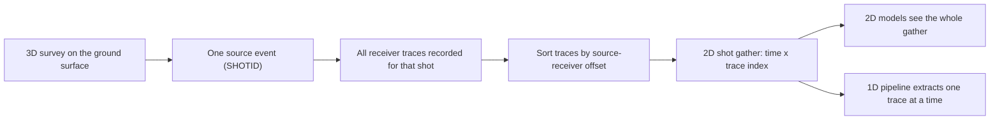

### What a shot gather looks like to a non-expert

A shot gather is a grid of numbers. Each column is one receiver trace. Each row is one moment in time. The image below shows that structure explicitly.

- the horizontal axis is trace index after sorting by offset,
- the vertical axis is time in milliseconds,
- the color encodes waveform amplitude,
- the red curve is the human first-break label: one arrival time per trace column.

When the traces are sorted by offset, the first-break picks usually form a smooth left-to-right curve. Near receivers record the arrival earlier; far receivers record it later. A convolutional model can exploit that spatial continuity immediately. A model that sees only one trace in isolation cannot see the curve at all.

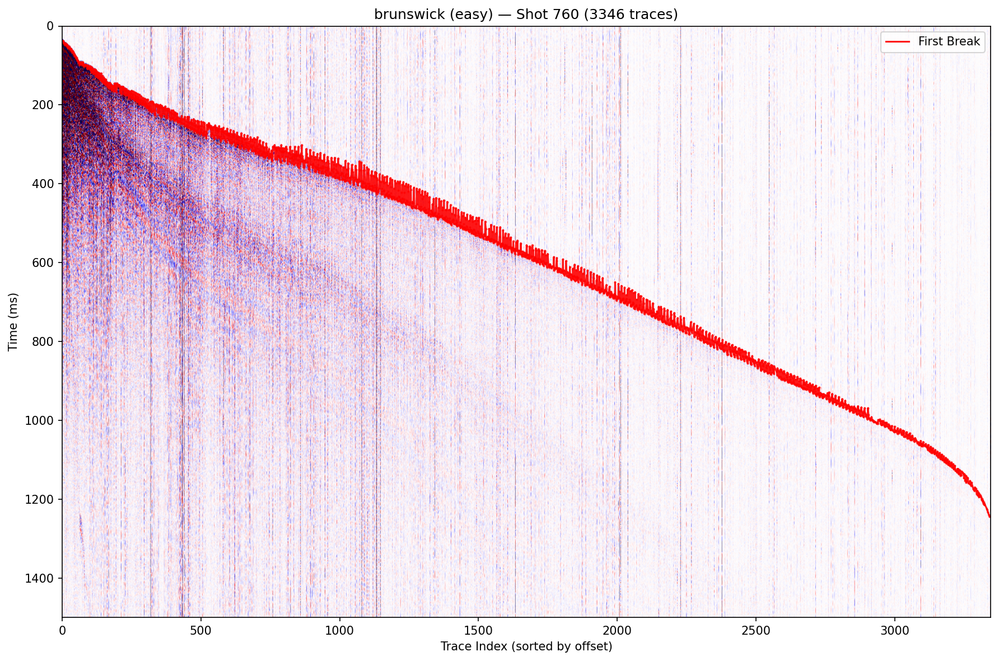

The figure above is a good visual definition of the target itself. The red curve is not a segmentation region or a classification label; it is a single continuous time value for every column. This is why the final output layer in the main models predicts a time distribution over the vertical axis and then converts it into one continuous millisecond prediction per trace.

### Why this task sits between computer vision and tabular data

The gather image is a computer-vision input, because neighboring columns and the smooth moveout curve are spatial patterns. But the strongest prior available to the task is source-receiver offset, which comes from metadata coordinates and therefore belongs to the tabular side of the problem.

This leads to a useful mental model:

- the **image view** tells the model what the waveform field looks like across neighboring traces,
- the **tabular view** tells the model how far the receiver is from the source and what geometric regime the trace belongs to.

In the current repository, the 2D models exploit offset implicitly through the ordered gather structure. The current 1D neural models do **not** ingest offset explicitly, which later turns out to be an important limitation.

### The 1D representation used by the baseline neural families

The trace-level pipeline uses `trace_collate_fn` in `src/data/dataset.py` to extract only valid labeled traces from processed gathers and batch them as tensors of shape `[P, 1, 751]`.

That framing is computationally simple, but it gives up two things at once:

- neighboring-trace context,
- the visible moveout curve that disambiguates weak arrivals.

This is the central representation tradeoff that the benchmark later tests.

---

## 5. Related Work and Benchmark Context

This project is not built in a vacuum. The repository is best understood as one point inside a larger first-break-picking literature that has moved from classical picking rules toward deep gather-based models, transfer learning, and more geometry-aware designs.

### What the main prior works contribute

| Work | Data / benchmark scope | Representation and preprocessing direction | Metrics and reported lesson | Why it matters here |
| :--- | :--- | :--- | :--- | :--- |
| **St-Charles et al. (2021, 2024)** | Introduced the HardPicks multi-survey benchmark on Brunswick, Halfmile, Lalor, and Sudbury | Gather-based deep models on a public multi-survey benchmark with survey-level folds | Reports benchmark errors and hit-rate style metrics under leave-one-survey-out evaluation | Supplies the data, the official benchmark protocol, and the baseline comparison target |
| **Zwartjes and Yoo (2022)** | First-break picking outside the exact HardPicks setup | Compares deep architectures for the picking task | Shows that architecture choice materially changes performance | Supports the decision to compare several model families rather than assume one network is enough |
| **Mardan et al. (2024)** | Transfer-learning workflow for automatic first-break picking with limited labeling | Fine-tuning a pretrained deep model on small labeled subsets from one survey | Emphasizes that transfer learning is useful when labels are scarce | Makes the pretrained ResNet-UNet a scientifically motivated choice rather than an arbitrary one |
| **DSU-Net (2024)** | HardPicks-style 2D first-break picking | Extends U-Net segmentation with dynamic snake convolutions to favor horizontal continuity and jumps | Shows that better 2D spatial modeling improves picking | Reinforces the idea that gather-level continuity is a core signal source |
| **DGL-FB (2024)** | HardPicks-style benchmark setting with graph learning | Moves beyond plain image grids by encoding higher-dimensional source-receiver relations | Argues that more explicit geometry improves robustness | Points toward a future direction beyond standard CNN gathers |

### How this repository is similar to the literature

The repository agrees with several broad literature trends:

- gather-level context is more informative than treating each trace independently,
- transfer learning is a reasonable idea for seismic picking even though the source domain is natural images,
- geometry matters enough that purely local single-trace modeling is unlikely to be sufficient,
- benchmark claims must be tied carefully to the actual evaluation protocol.

### How this repository deliberately differs

The repository also makes several deliberate choices of its own:

- It preserves post-harmonization gather width and uses **dynamic batch padding** instead of reshaping every gather to one fixed global width.
- It treats the target as **regression in milliseconds** and uses **Soft-Argmax** time expectation rather than a hard segmentation mask as the final prediction mechanism.
- It harmonizes all four surveys to a common temporal grid of **751 samples at 2 ms** while trying to preserve the native moveout pattern rather than removing it through heavier geometry-specific transforms.
- It benchmarks under a **deterministic internal per-asset split**, not yet under the official leave-one-survey-out HardPicks folds.

### What should and should not be compared directly

The architectural trends are comparable. The exact leaderboard values are not, because the evaluation question is different.

- The official HardPicks protocol asks: **can the model generalize to a completely unseen survey?**
- The current repository asks: **if each survey contributes train, validation, and test shots, which model works best on held-out shots from the same four surveys?**

Both questions are valid. They are simply not the same question.

---

## 6. Data Fields Used by the Pipeline

The repository does not treat the HDF5 headers as incidental metadata. Several of them are structurally necessary for turning raw traces into model-ready inputs.

### Key fields and what they mean

| Field | What it represents physically | Why it matters for the pipeline |
| :--- | :--- | :--- |
| `data_array` | The raw seismic waveform: a time-indexed measurement of ground motion for one receiver during one shot event | This is the actual signal the models learn from. Every column in the 2D gather image comes from one row of this array. |
| `SHOTID` | The identifier of the source event that generated the trace | This is the main grouping key. Without `SHOTID`, the pipeline cannot know which traces belong in the same gather. |
| `SHOT_PEG` | An alternate shot identifier found in some assets | Useful for auditing and cross-checking survey structure, but `SHOTID` is the canonical grouping key in the implemented pipeline. |
| `SOURCE_X`, `SOURCE_Y`, `SOURCE_HT` | The source location and elevation | Combined with receiver coordinates, these allow source-receiver geometry to be reconstructed and offsets to be computed if needed. |
| `REC_X`, `REC_Y`, `REC_HT` | The receiver location and elevation | These define where each trace was recorded. They are essential for offset calculations and for sanity-checking the acquisition geometry. |
| `REC_PEG` | Receiver identifier | Useful for acquisition bookkeeping and audit-style checks, though not the primary modeling feature itself. |
| `SAMP_RATE` | The time interval between consecutive samples, stored in microseconds | Converts sample index into physical time. This is critical because Lalor uses `1000` microseconds per sample while the other surveys use `2000`, so the same sample index would mean a different physical arrival time without harmonization. |
| `SAMP_NUM` | The number of recorded samples per trace | Determines trace length. Sudbury has a longer raw window than the others, so this field is needed to harmonize the time axis. |
| `COORD_SCALE` and `HT_SCALE` | SEG-Y scaling rules that convert stored integer coordinates into physical distances and elevations | Without these, distance calculations can be wrong by orders of magnitude. This was especially important in understanding Sudbury's awkward coordinate behavior. |
| `SPARE1` | A project-specific header field used here to store manually picked first-break time in milliseconds | This is the actual ground-truth label. A positive value indicates a usable pick. Zero or `-1` indicates missing or invalid label depending on the asset. |

### Why the metadata matters, not just the waveforms

Each field does one of three jobs:

- it tells the pipeline **how to group traces** into a gather,
- it tells the pipeline **how to interpret time and space** correctly,
- it tells the pipeline **what the ground truth is**.

That is why this task is not a pure image problem. The waveform alone is not enough to build the right 2D input. The metadata decides how the image should exist in the first place.

### Discoveries from the supplementary audit

The supplementary notebook did not merely confirm expectations; it invalidated several tempting assumptions:

- `FIRST_BREAK_TIME` was effectively all zeros in this dataset release.
- `MODELLED_BREAK_TIME` was effectively all zeros.
- `FIRST_BREAK_AMPLIT` and `FIRST_BREAK_VELOCITY` were effectively all zeros where present.
- `SPARE1` was stored as shape `(N, 1)` rather than a flat vector, which matters for safe downstream handling.

This means the pipeline could not rely on a rich set of label-like auxiliary headers. In practice, `SPARE1` is the sole usable human annotation field, and the model must learn from waveform structure plus basic geometry rather than from redundant precomputed targets.

### Why `COORD_SCALE` needed careful treatment

SEG-Y scaling rules are easy to misuse if one assumes coordinates are already in physical units. The convention is:

- if the scale is positive, multiply,
- if the scale is negative, divide by its absolute value.

Applying that rule correctly is essential. Brunswick and Lalor use negative scale factors that imply division. Halfmile is effectively identity-scaled. Sudbury is the awkward case: its raw coordinate values can look absurd in absolute magnitude if used naively, which is why the final pipeline prefers precomputed offset fields when available and falls back to scaled Euclidean distance only when necessary.

---

## 7. EDA Notebook-by-Notebook Findings

The project has five core EDA notebooks:

- `notebooks/01_eda_brunswick.ipynb`
- `notebooks/01_eda_halfmile.ipynb`
- `notebooks/01_eda_lalor.ipynb`
- `notebooks/01_eda_sudbury.ipynb`
- `notebooks/01_eda_combined.ipynb`

Two additional notebooks matter for understanding the final pipeline:

- `notebooks/00_environment_setup.ipynb`, which performs the first raw-data verification and produces the initial sanity plot,
- `notebooks/01_eda_supplementary.ipynb`, which revisits early assumptions about labels, resampling, geometry, and memory.

Each subsection below follows the same structure:

- **Question:** what we were trying to find out.
- **Method:** how the notebook investigated it.
- **Results:** what the notebook found.
- **Implication:** how that finding changed the final design.

### 7.1 Verification notebook (`00_environment_setup.ipynb`)

- **Question:** Do the raw files load correctly, and do the four surveys already look visibly different before any preprocessing?
- **Method:** The notebook loads representative traces from all four assets and overlays the stored first-break location on each raw waveform.
- **Results:** The surveys already differ in amplitude scale, noise floor, onset sharpness, and waveform texture before any gather construction. The original Colab notebook prints `Saved sanity plot: /content/drive/MyDrive/seismic-first-break-picking/results/sanity_plots/00_first_traces.png`; in the repository the same figure lives at `results/sanity_plots/00_first_traces.png`.
- **Implication:** This was the first evidence that one universal amplitude assumption would be unsafe. It justified later decisions such as per-trace normalization, temporal harmonization, and survey-aware training.

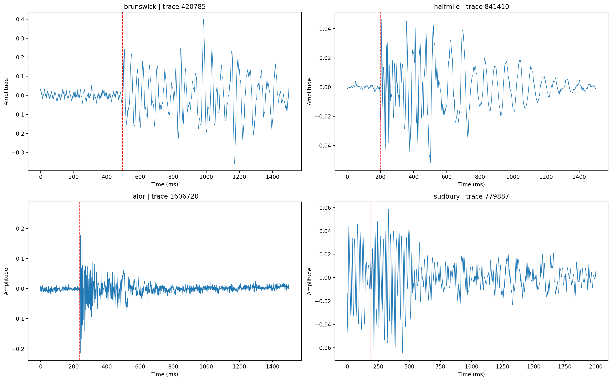

Each panel above is one representative raw trace, and the red dashed line marks the human first break. The key thing to notice is not just where the arrival happens, but how different the trace appearance is across assets: Lalor has a sharp, energetic onset, Sudbury is visibly noisier and longer, and Brunswick and Halfmile have different decay and oscillation character. That visual mismatch is why the rest of the pipeline had to be evidence-driven rather than generic.

### 7.2 Brunswick notebook

- **Question:** How large and difficult is Brunswick, and what will it demand from memory and preprocessing?
- **Method:** The notebook audited label coverage, first-break statistics, gather widths, amplitude structure, and a coherence-style label quality check across gathers.
- **Results:** Brunswick is the largest survey in the project with about 4.50 million traces and 83.02% labeled traces in the raw audit. Its median first-break time is 384 ms, its maximum recorded first-break time is 1358 ms, and its median gather width is 2975 traces. The EDA also used a polynomial coherence audit: within a gather, a low-order polynomial was fit to first-break time as a function of ordered trace position, and labels with unusually large residuals were counted as suspected outliers. The outlier fraction was low, around 0.39%.
- **Implication:** Brunswick is the main reason the repository keeps the full 1500 ms window, balances assets during training, and uses width-aware collation rather than a naive fixed-width tensor for every gather.

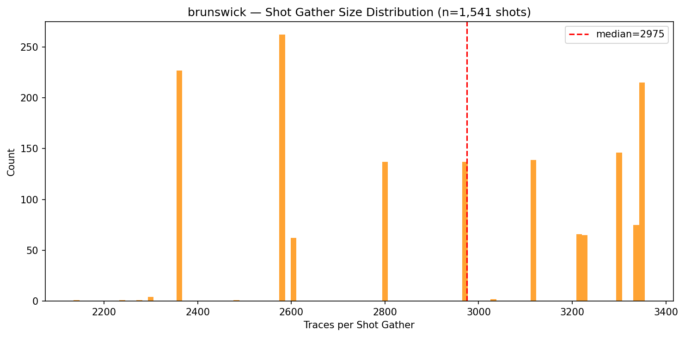

This histogram matters because it makes the memory problem concrete. Brunswick is not only wider than the other assets on average; it is consistently wider, with a median gather almost twice the width of Halfmile. If every batch were padded to the global maximum width, a large fraction of the compute for narrower assets would be spent on zeros.

### 7.3 Halfmile notebook

- **Question:** Is there an asset that behaves like the most regular or clean survey in the collection?
- **Method:** The notebook measured label density, gather-size variability, dead-trace fraction, offset structure, and first-break statistics.
- **Results:** Halfmile contains about 1.10 million traces with roughly 90.33% labeled traces in the raw audit, the highest label coverage of the four assets. Its gather widths are tightly concentrated around 1575 to 1604 traces, and the sampled dead-trace fraction is about 1.36%, the highest among the four assets in that audit.
- **Implication:** Halfmile acts as a useful contrast case. It confirms that dead-trace handling is not optional, while also showing what a geometrically regular asset looks like compared with Brunswick and Sudbury.

### 7.4 Lalor notebook

- **Question:** What exactly makes Lalor different: weak signal, different timing, different hardware, or label quality?
- **Method:** The notebook measured sample rate, trace length, amplitude range, first-break statistics, label density, and signal-to-noise characteristics; the supplementary notebook later compared resampling methods directly.
- **Results:** Lalor is the only survey sampled at 1 ms with 1501 samples per trace in raw form. It has about 2.42 million traces, only about 50% label coverage, and the highest outlier fraction in the raw quality audit at about 1.38%. Importantly, the refined SNR analysis shows that Lalor often has strong signal quality rather than uniformly weak traces.
- **Implication:** Lalor's main challenge is not that the arrival is invisible. The main challenge is that its temporal resolution differs from the other assets and its labels are only partially available. That is why explicit resampling and masking mattered more than any sensor-specific handcrafted correction.

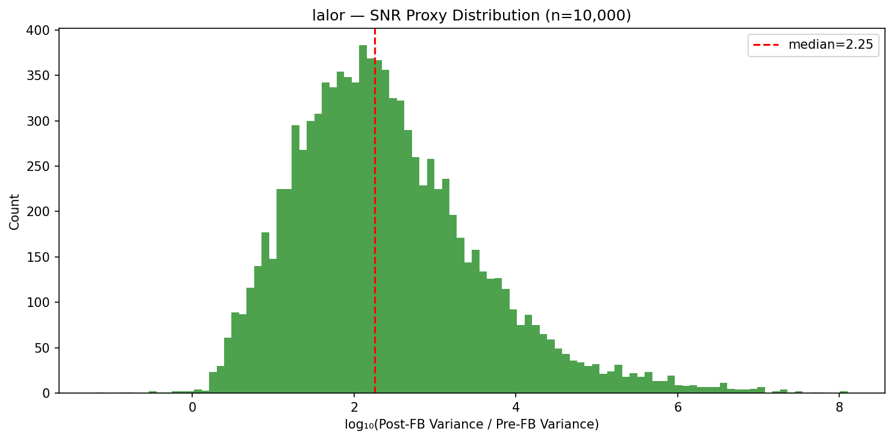

The plot above should be read carefully. High SNR values mean Lalor is often easier at the waveform level than one might assume from its heterogeneity. The real engineering challenge is not weak signal; it is that Lalor lives on a different sample grid from the other surveys, so concatenating the data naively would put its arrivals on the wrong physical time axis.

### 7.5 Sudbury notebook

- **Question:** How should the pipeline treat an asset with very sparse labels and awkward coordinate scaling?
- **Method:** The notebook audited label density, raw time-window length, gather widths, and first-break-versus-offset structure.
- **Results:** Sudbury contains about 1.81 million traces but only about 11.07% labeled traces in the raw audit. Its raw traces span 2000 ms with 1001 samples, and 301 shot gathers contain zero labels. Naive use of raw coordinate fields can also produce implausible absolute positions.
- **Implication:** Sudbury is the strongest argument for preserving unlabeled traces as real input context while masking them from the loss. It is also why the repository crops to a common 1500 ms window and prefers precomputed offsets over naive coordinate-derived distances when possible.

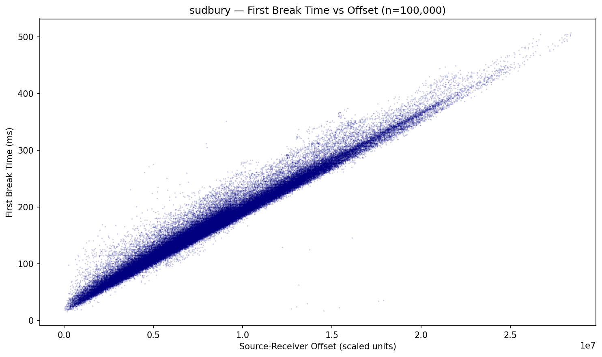

Each point in this scatter plot is one labeled trace. The horizontal axis is offset, the vertical axis is first-break time, and the relative sparsity of points itself is part of the story: compared with the denser Brunswick or Halfmile structure, Sudbury simply contains far fewer supervised positions. That is why masking was preferable to deleting whole traces or whole gathers and losing valuable geometric context.

### 7.6 Combined notebook

- **Question:** Can the four surveys be concatenated directly into one dataset without special treatment?
- **Method:** The notebook compared assets side by side on sample rate, trace length, gather size, label density, amplitude range, timing statistics, and coordinate behavior.
- **Results:** The answer is no. The assets disagree on sample interval, number of samples, label density, gather width, amplitude range, and coordinate scaling. Brunswick is latest and widest, Sudbury is earliest and sparsest, Lalor is the only 1 ms survey, and Halfmile is the most geometrically regular.
- **Implication:** The combined notebook is the reason the final pipeline standardizes all assets to a common temporal grid, uses balanced multi-asset sampling, and treats internal-split claims separately from future cross-survey claims.

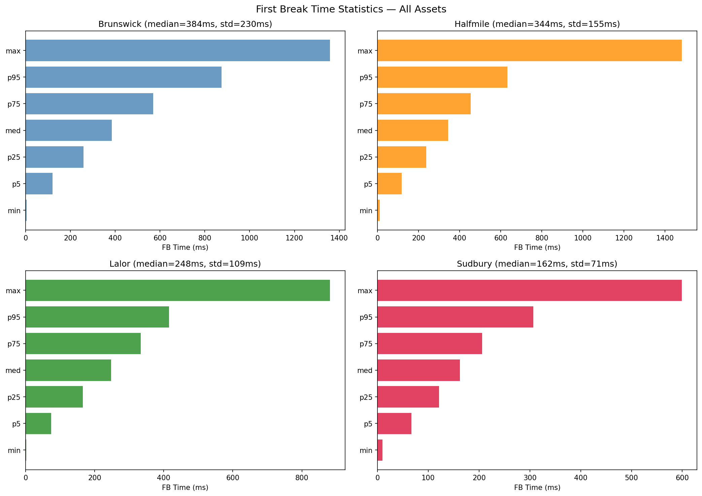

This figure shows that the task is not governed by one common arrival-time distribution. Brunswick occupies much later times than Sudbury, with Halfmile and Lalor in between. That is why the split strategy stratifies by median first-break time and why any aggregate metric has to be interpreted as an average over genuinely different timing regimes.

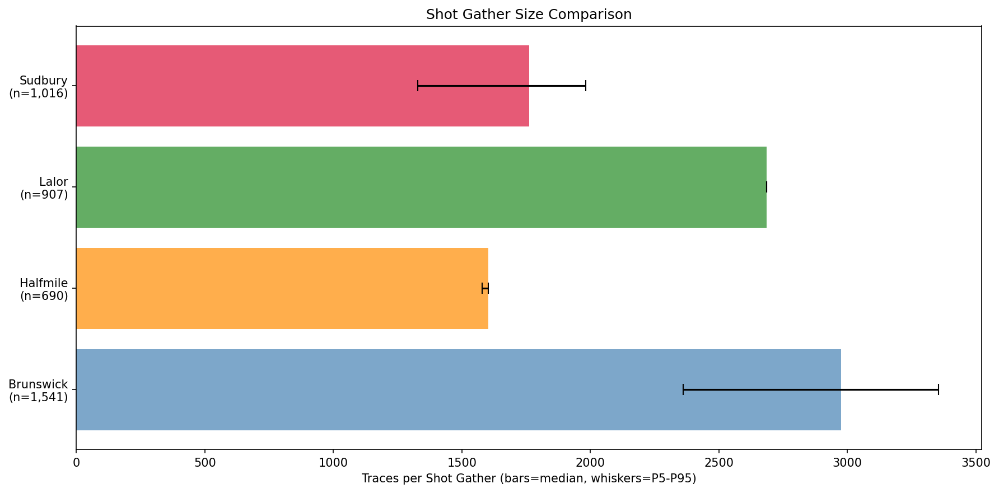

This plot is one of the clearest justifications for variable-width batching. Halfmile sits around 1600 traces, Sudbury around 1760, Lalor around 2685, and Brunswick around 2975. If every batch were padded to the widest possible case, large amounts of memory and compute would be wasted on empty columns for the narrower assets.

### 7.7 Supplementary notebook

- **Question:** Which early assumptions survive closer inspection when labels, resampling, geometry, and memory are audited more carefully?
- **Method:** The notebook inspected dormant label-like fields, validated `SPARE1`, compared Lalor resampling methods, redefined shot-level SNR, checked spatial scaling sanity, and estimated gather memory cost.
- **Results:** It confirmed that `SPARE1` is the only usable label field, that `resample_poly` preserves the first-break neighborhood well enough for Lalor harmonization, that Sudbury's coordinate behavior should be handled cautiously, and that Brunswick-scale gathers justify both a width cap of 4096 and divisibility constraints.
- **Implication:** This notebook is why the implemented pipeline differs from the earliest informal plan. It converted vague concerns into concrete engineering rules.

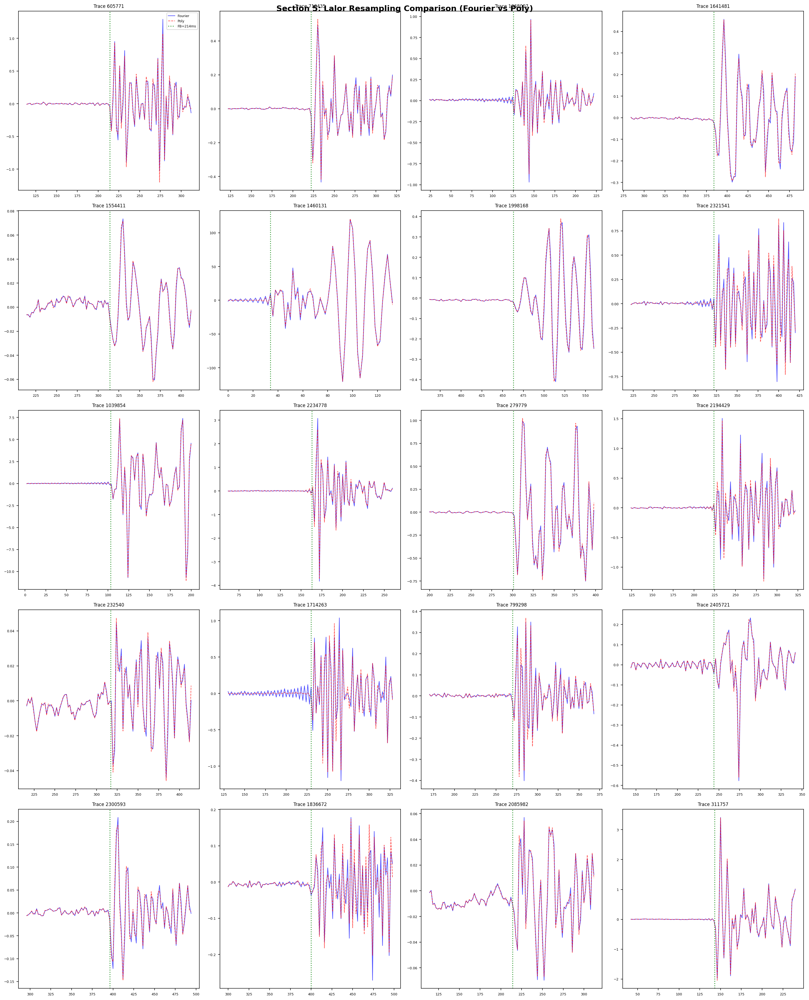

The purpose of this figure is very specific: it shows that downsampling Lalor from 1 ms to 2 ms does not destroy the local first-break neighborhood that the model needs. Because the polyphase resampling and Fourier-style alternative are visually close around the arrival, the repository could adopt `resample_poly` and proceed with a single common time axis across assets.

---

## 8. What the EDA Changed in the Final Pipeline

The final pipeline is not a generic preprocessing stack. It is a direct consequence of the notebook findings.

| EDA finding | Final decision | Why this decision, not the obvious alternative |
| :--- | :--- | :--- |
| Lalor uses 1 ms sampling while the others use 2 ms | Resample Lalor to 2 ms with `scipy.signal.resample_poly` | Training on mixed sample rates would make the same sample index mean different physical time across assets. |
| Sudbury has a 2000 ms raw window with 1001 samples | Crop Sudbury to the first 751 samples / 1500 ms | Keeping a longer raw window for one asset would make the common target shape inconsistent and add late-time padding for the others. |
| Label density is highly uneven across assets | Use `BalancedAssetSampler` during training | Without balancing, Brunswick would dominate simply because it has the most traces. |
| Sudbury contains many unlabeled traces and even unlabeled gathers | Keep unlabeled traces as 2D input context, but mask them from loss and metrics | Deleting them would remove real spatial context from the gather and make Sudbury artificially easier but less realistic. |
| Brunswick gathers are very wide | Use variable-width batching, local padding, width cap `4096`, and divisibility `16` | Padding everything to a single global maximum would waste memory and compute, especially for Halfmile and Sudbury. |
| Several precomputed label-like fields are dead | Use `SPARE1` as the sole ground truth | The apparently richer label fields are all zero in this release, so relying on them would be incorrect. |
| Coordinate scaling is inconsistent across assets | Prefer precomputed offsets and use scaled Euclidean distance only as fallback | Sudbury shows that naive coordinate use can produce implausible absolute positions even when relative geometry is still coherent. |
| Some labels appear suspicious in the EDA quality audit | Mask suspect labels instead of deleting entire gathers | The neighboring traces still carry useful spatial information even when one label is dubious. |
| Amplitude ranges differ strongly across assets | Use per-trace max-absolute normalization | A single global amplitude scale would let one survey dominate the normalization statistics. |

### Two important clarifications

**No label imputation was used.** Unlabeled traces were not given synthetic targets in the current benchmark. They are either removed from 1D supervision or retained as context but excluded from the 2D loss.

**No feature imputation was used.** Waveform amplitudes are not filled in, and dead traces are not replaced with fabricated signal. They are handled by safe normalization and masking.

---

## 9. Preprocessing and Transformation Pipeline

The implementation lives mainly in `src/data/shot_gather_builder.py`, `src/data/dataset.py`, and `src/data/transforms.py`. The important point is that this pipeline was shaped by the data, not by a generic template.

### 9.1 Verification before transformation

Before the pipeline writes any processed training example, it verifies several failure modes that would otherwise corrupt the benchmark silently:

- the HDF5 archives load correctly,
- the expected header fields exist,
- `SPARE1` has the expected semantics and shape,
- the SEG-Y coordinate scaling rules are interpreted correctly,
- waveform and label overlays look physically sane.

These checks were not ceremonial. They caught real issues: `SPARE1` had shape `(N, 1)` rather than a flat vector, several other label-like fields were all zero, and coordinate scaling required dataset-specific care.

### 9.2 What would go wrong without harmonization

A naive practitioner might try to concatenate all four surveys directly after loading them. That would fail for several reasons:

- in Lalor, sample index `200` means `200 ms`, but in Brunswick or Halfmile it means `400 ms`,
- Sudbury traces are longer than the other assets, so tensor shapes would disagree,
- amplitude ranges differ strongly across surveys, so one global scale would distort some assets,
- gather widths differ enough that a fixed tensor size would be either too small or very wasteful,
- coordinate scaling differs, so naive distance calculations can be wrong.

The entire preprocessing stack exists to prevent those mistakes.

### 9.3 Temporal harmonization

The common target format used by the current benchmark is:

- sample rate: `2 ms`,
- samples per trace: `751`,
- time window: `1500 ms`.

Asset by asset, the transformation is:

- **Brunswick:** already `751` samples at `2 ms`, so it passes through unchanged.
- **Halfmile:** already `751` samples at `2 ms`, so it passes through unchanged.
- **Lalor:** downsampled from `1501` samples at `1 ms` to `751` samples at `2 ms` with `resample_poly`.
- **Sudbury:** cropped from `1001` samples at `2 ms` to the first `751` samples.

### 9.4 Gather construction and offset ordering

Each processed gather is built as follows:

1. group traces by `SHOTID`,
2. load or compute source-receiver offset,
3. sort traces by offset,
4. harmonize the time axis,
5. transpose the array to `[751, K]`, where `K` is gather width,
6. normalize amplitudes,
7. validate labels and create masks,
8. save one `.npz` file per gather.

Sorting by offset is crucial. It makes the moveout pattern visible and turns the gather into a meaningful image rather than a random permutation of trace columns.


This figure is the strongest single visual summary of the preprocessing pipeline. All twelve gathers share the same vertical time axis after harmonization, yet still preserve their own spatial structure and difficulty. The overlaid green curves show that the label masks and timing transforms produce sensible processed inputs rather than distorted artifacts.

### 9.5 Normalization and standardization

The default amplitude transform is **per-trace max-absolute normalization**:

```text
trace_norm = trace / (max(abs(trace)) + epsilon)
```

This was chosen for concrete reasons:

- it is robust to the large amplitude spread observed across assets,
- it keeps every trace in a comparable numerical range,
- it avoids letting a high-amplitude survey dominate global normalization statistics,
- it is simple and deterministic.

Just as importantly, the project **does not** use global z-score normalization across the whole dataset. That would blur survey-specific amplitude structure into one set of global moments and make the strongest-amplitude assets disproportionately influential. Per-trace normalization is also one reason the repository favors regression with Soft-Argmax over a hard segmentation framing: once each trace is independently scaled, weak pre-arrival noise can appear visually larger than it would under raw amplitude, so a binary before/after region is less stable than predicting one arrival time.

### 9.6 Label validation and masking

The label pipeline begins with the rule `SPARE1 > 0`, then applies additional filters:

- **Minimum valid time:** labels below `1.0 ms` are rejected because they are physically implausible as meaningful arrivals and are more likely to be corrupt placeholders or edge artifacts.
- **Trace-duration validity:** labels later than the end of the trace are rejected.
- **Per-asset high-end filter:** labels above the `99.5` percentile are masked using a threshold computed from the **training split only** for that asset. This avoids leaking test-set information into preprocessing.
- **Dead-trace masking:** traces with effectively zero signal are masked.
- **Gather-level coherence checks:** after sorting by offset, abrupt local jumps are treated as suspicious and masked rather than trusted blindly.

The EDA polynomial coherence check and the production code are related but not identical. The notebook fit a low-order polynomial to estimate how often mispicks occurred. The final pipeline uses simpler local coherence rules operationally, because the goal in preprocessing is not to fit a smooth scientific model of every gather but to remove clearly suspicious supervision while preserving the gather context.

### 9.7 Variable-width batching and memory control

The repository does **not** resize every gather to one common width. Instead, `variable_width_collate_fn` pads each batch only to the local maximum width, rounded up to a divisibility constraint of `16`.

The supplementary notebook makes the reason concrete. For Brunswick at the harmonized shape of `751` samples:

- a median gather width of `2975` traces is about `68.18 MB` for a batch of 8 just for the input tensor in float32,
- padding to width `4096` pushes that to about `93.88 MB` before activations,
- Halfmile and Sudbury would waste a large fraction of that width on zeros.

That is why the README should describe variable-width batching as a core design decision, not an implementation detail.

### 9.8 Split strategy and imbalance handling

The current repository benchmark uses a deterministic **per-asset stratified `70 / 15 / 15` split** stored in `data/processed/split_index.csv`.

The split is constructed at the **shot level**, not the trace level, and stratified by median first-break time per gather. That matters because it:

- prevents leakage between train and test through traces from the same shot,
- preserves early, medium, and late arrival regimes inside each asset,
- gives every asset train, validation, and test representation.

The pipeline then addresses imbalance in two different ways:

- **Asset imbalance:** `BalancedAssetSampler` oversamples smaller assets at the gather level so Brunswick does not dominate simply because it is largest.
- **Label imbalance:** 2D models keep real unlabeled traces as context but apply loss only where `label_mask` is true. The 1D collate function extracts only valid labeled traces.

### 9.9 Augmentation

The current augmentation stack is intentionally conservative and physically plausible:

- amplitude scaling,
- additive Gaussian noise,
- trace dropout,
- small time shifts,
- polarity reversal.

The pipeline avoids augmentations that would break the physics or the acquisition geometry:

- horizontal flips,
- vertical flips,
- arbitrary rotations,
- random crops that destroy offset order.

### 9.10 Relation to prior preprocessing choices in the literature

Published first-break papers often share the same broad goals but make different engineering compromises. Some resize or reshape gathers aggressively to satisfy fixed model input sizes. Some treat the output as segmentation. Some use heavier geometry-specific transforms before learning. This repository makes a different tradeoff:

- it preserves the visible moveout pattern,
- it standardizes only the time axis and sample rate,
- it keeps original post-harmonization gather widths until collation time,
- it predicts one continuous time per trace instead of a hard binary region.

That combination is one of the defining methodological choices of the project.

---

## 10. Model Families, Expected Behavior, and Architectural Choices

### 10.1 Why benchmark several model families at all

Comparing several architectures is not redundancy; it is the scientific point. The practical lesson of the No Free Lunch theorem is that no learning algorithm is universally best across all possible data distributions. Different model families encode different assumptions about locality, geometry, smoothness, and feature reuse. In a heterogeneous multi-survey seismic problem, those assumptions matter enough that empirical comparison is necessary.

### 10.2 What we expected before seeing the results

Before running the benchmark, the project had several reasonable hypotheses:

- **Trace-only neural models** should learn local onset texture, but they should plateau because they cannot see the neighboring-trace moveout curve and do not explicitly ingest offset.
- **Gather-level 2D models** should outperform 1D models because the first-break curve is a spatial object, not just a per-trace local event.
- **A pretrained 2D model** should optimize faster than a randomly initialized 2D model because the encoder begins with useful edge and boundary detectors.
- **A purely tabular baseline** should benefit from offset and simple handcrafted features, but it would still sacrifice raw gather context. The codebase contains such a direction in `src/features/` and `src/models/tabular.py`, but the current benchmark tables focus on the five trained neural models.

These hypotheses matter because they make the analysis section more than post-hoc storytelling. The benchmark is testing concrete representation claims.

### 10.3 1D neural models

The trace-level neural models are implemented mainly in `src/models/cnn_1d.py` and `src/models/unet_1d.py`.

**CNN-1D**

- stacked temporal convolutions,
- batch normalization and ReLU,
- pooling to compress time,
- adaptive average pooling,
- small MLP regression head.

**ResNet-1D**

- residual temporal blocks,
- deeper receptive field than the plain CNN,
- global average pooling,
- linear regression head.

**SoftArgmax 1D U-Net**

- encoder-decoder on a single trace,
- skip connections,
- per-sample logits over time,
- Soft-Argmax expectation to turn that temporal distribution into a millisecond prediction.

The central limitation of the current 1D family should be stated plainly: these models operate on waveform shape only and do **not** explicitly ingest offset as an additional input. They therefore give up the strongest physical prior available to the problem and must infer arrival timing from local trace appearance alone.

### 10.4 2D gather-level models

The main gather-level models live in `src/models/unet.py`.

**SoftArgmax U-Net (custom 2D model)**

- input shape `[B, 1, T, W]`, where `T = 751` and `W` is the padded gather width,
- four downsampling stages,
- decoder with skip connections,
- per-trace time distribution collapsed by Soft-Argmax.

The training notebook reports about `7.76M` trainable parameters for this model.

**ResNet-UNet with ImageNet pretraining**

- wraps `segmentation_models_pytorch.Unet`,
- uses a ResNet-34 encoder initialized from ImageNet,
- repeats the single seismic channel to three channels to match the encoder interface,
- applies the same Soft-Argmax time expectation idea at the output.

The training notebook reports about `24.44M` trainable parameters for this model.

These models are scientifically attractive because one forward pass predicts all traces in a gather and can exploit the smooth cross-trace arrival structure directly.

### 10.5 Symmetric versus asymmetric pooling

This project deliberately uses **symmetric pooling** in time and width for the custom 2D U-Net. That choice deserves explanation because some seismic U-Net variants prefer to preserve the width dimension more aggressively.

In this repository, preserving thousands of trace columns deep into the bottleneck would make Brunswick-scale gathers prohibitively expensive on T4-class hardware. Symmetric `(2, 2)` pooling was therefore the pragmatic choice: it reduces both time and width through the encoder, keeps the model trainable on wide gathers, and avoids catastrophic out-of-memory behavior.

### 10.6 Why the Soft-Argmax head matters

The Soft-Argmax head is one of the most important design choices in the project.

Instead of emitting an unconstrained scalar with no temporal structure, the model first predicts a distribution over time for each trace. The Soft-Argmax then converts that distribution into a continuous millisecond estimate. This has two advantages:

- it keeps the output aligned with the physical time axis,
- it avoids forcing a brittle hard segmentation boundary in noisy, independently normalized traces.

### 10.7 The computer-vision versus tabular-data tension appears again here

The 2D models are effectively computer-vision systems on ordered shot gathers. The geometric metadata enters mainly by determining the trace ordering and offset structure that makes the gather image meaningful. The current 1D neural models, by contrast, see only the waveform column and therefore miss explicit geometric priors.

This is important for interpreting the benchmark. A 1D architecture is not only shallower in spatial context; it is also poorer in metadata usage.

---

## 11. Training Strategy and Infrastructure

### 11.1 Why combined multi-asset training was chosen

The benchmarked neural models are trained in **combined mode**, meaning the training set contains all four assets at once through a balanced sampler.

This was chosen for several reasons:

- it exposes the model to multiple acquisition regimes during the same optimization run,
- it prevents the largest asset from silently becoming the only effective training distribution,
- it produces a reusable multi-asset benchmark rather than a single-survey case study,
- it avoids the future-user trap of sequential fine-tuning across surveys.

That last point matters. If the project had been trained survey by survey in sequence, any later researcher who wanted to continue training with more compute or more data would immediately face the risk of **catastrophic forgetting**, where later fine-tuning overwrites what was learned from earlier surveys. Combined training avoids anchoring the weights to one survey at a time and is therefore the safer default for future extensibility.

The codebase also contains a `ProgressiveAssetSampler`, which reflects that this issue was considered explicitly even though the current benchmarked runs use the balanced combined regime.

### 11.2 Google-centered execution environment and hardware constraints

The notebooks are designed around the Google ecosystem: Google Drive paths, Google Colab notebooks, and a workflow that can later be moved to stronger Google-managed execution such as Vertex AI or Colab Enterprise. The executed ResNet-UNet training notebook reports a `Tesla T4` GPU with about `15.64 GB` of VRAM.

That hardware constraint shaped the benchmark directly:

- batch sizes for wide 2D gathers had to stay small,
- gradient accumulation was required to reach a useful effective batch size,
- symmetric pooling became necessary for the custom 2D model,
- the project had to choose between going deeper on one survey or going shallower on all four.

The repository chose the second option. It is scientifically more useful to benchmark all four assets together for 30 epochs than to overfit one survey deeply and learn less about the multi-asset problem.

### 11.3 The 30-epoch champion-selection setup

The current benchmark is a fixed-compute comparison. The main neural models were trained with a 30-epoch budget and the best checkpoint was selected by validation performance.

The executed configs are:

| Model | Batch size | Gradient accumulation | Epoch budget |
| :--- | ---: | ---: | ---: |
| ResNet-UNet | 2 | 4 | 30 |
| UNet-2D | 1 | 4 | 30 |
| CNN-1D | 2 | 4 | 30 |
| ResNet-1D | 2 | 4 | 30 |
| UNet-1D | 1 | 8 | 30 |

This means the current winners should be read as **champions under a fixed resource budget**, not as fully saturated or final upper bounds. Several of them would likely benefit from longer training, larger batches, or more extensive tuning.

### 11.4 Losses, masking, and runtime controls

The training loop supports masked regression losses such as `MaskedMAELoss` and `MaskedHuberLoss`. That is essential because:

- not every trace has a valid label,
- 2D batches include padded columns,
- Sudbury contributes many real but unlabeled traces,
- the benchmark must avoid invalid targets contaminating the loss.

The trainer also supports:

- automatic mixed precision on CUDA,
- gradient accumulation,
- gradient clipping,
- checkpointing and resume-safe training,
- deterministic config-driven execution.

These are not optional comforts; they are what make wide-gather training practical on T4-class hardware.

### 11.5 Why MLflow was used

The repository uses MLflow through `src/training/mlflow_logger.py` to log:

- flattened training configs,
- scalar metrics across epochs,
- checkpoints and plots as artifacts,
- run identities in a reproducible way.

This matters because the project compares multiple architectures under many configuration settings. MLflow removes the need to track experiments manually across notebooks and makes it possible to audit which run produced which artifact.

### 11.6 What exists in the codebase but was not fully exercised in the current benchmark

The repository contains additional models and training directions beyond the five benchmarked neural families, and the notebook environment already installs tools such as `optuna`. But the current benchmark does **not** include:

- systematic hyperparameter search,
- staged transfer-learning schedules such as gradual unfreezing,
- pseudo-labeling,
- full benchmarking of every implemented architecture.

That omission is not conceptual; it is mainly a compute-budget decision.

---

## 12. Evaluation Protocol and Metrics

### 12.1 What this README currently evaluates

The repository's current benchmark answers a specific question:

- split each asset into deterministic `70 / 15 / 15` train, validation, and test shots,
- train on the combined training partitions of all four assets with balanced sampling,
- validate on the combined validation partitions,
- report final metrics on the combined internal test partitions.

That is a legitimate held-out evaluation protocol. It measures how well a model generalizes to unseen **shots** from the same four surveys after each survey has contributed training data.

### 12.2 How that differs from the official HardPicks benchmark

The important distinction is about the **split**, not the **data source**.

- The repository **does use the official public HardPicks datasets**.
- The repository **does not yet use the official leave-one-survey-out evaluation protocol** for the current README's leaderboard.

In plain language, the difference is this:

| Question | Current repository split | Official HardPicks protocol |
| :--- | :--- | :--- |
| What is hidden from the model? | Some shots from every survey | One entire survey |
| What does the test measure? | Within-survey / in-distribution generalization | Cross-survey / out-of-distribution generalization |
| Does the model train on official data? | Yes | Yes |
| Is the benchmark question harder? | Moderate | Harder |

So the issue is **not** that the repository trained on the wrong data. The issue is only that it is currently answering an easier and different evaluation question.

### 12.3 Metrics used in the repository

| Metric | Why it is used |
| :--- | :--- |
| `MAE (ms)` | Primary metric. Easy to interpret physically: on average, how many milliseconds away is the pick? |
| `RMSE (ms)` | More sensitive to catastrophic misses than MAE, useful for understanding the heavy tail. |
| `Within-5 ms` | Strict tolerance metric. At 2 ms sampling this is roughly a 2 to 3 sample tolerance. |
| `Within-10 ms` | More forgiving and closer to a 5-sample tolerance at 2 ms, which makes it the closest ms-based analogue of the 5-pixel hit-rate style metric often reported in the literature. |
| `Latency (ms/trace)` | Accuracy alone is not enough for deployment; the picker must also be computationally usable. |

The repository keeps the target in physical milliseconds rather than standardizing it into abstract units. That makes the outputs easier to interpret and keeps the metric meaningful across the resampled multi-asset dataset.

### 12.4 What is not yet part of the current evaluation story

Two things should be stated honestly:

- The current README does not report the official leave-one-survey-out HardPicks folds.
- The current benchmark does not include statistical significance testing such as the Wilcoxon signed-rank tests envisioned in the project plan.

That means the leaderboard is best read as a strong internal comparison, not as a final benchmark paper claim.

---

## 13. Results on the Current Repository Split

The results below come from `notebooks/04_benchmark_and_compare.ipynb` and summarize the five neural models that were actually trained and exported in the benchmark notebook.

### 13.1 Aggregate leaderboard

#### Validation leaderboard

| Rank | Model | Val MAE (ms) | P90 error (ms) | Within 5 ms (%) | Within 10 ms (%) | CPU latency (ms/trace) |
| :--- | :--- | ---: | ---: | ---: | ---: | ---: |
| 1 | ResNet-UNet | 27.416 | 67.680 | 20.79 | 38.32 | 0.0774 |
| 2 | UNet-2D | 89.503 | 227.194 | 8.51 | 16.20 | 0.1187 |
| 3 | UNet-1D | 151.323 | 323.797 | 2.35 | 4.71 | 0.1917 |
| 4 | CNN-1D | 151.551 | 320.712 | 2.25 | 4.50 | 0.0542 |
| 5 | ResNet-1D | 151.853 | 326.232 | 2.30 | 4.60 | 0.0707 |

#### Test leaderboard

| Rank | Model | Test MAE (ms) | P90 error (ms) | Within 5 ms (%) | Within 10 ms (%) | CPU latency (ms/trace) |
| :--- | :--- | ---: | ---: | ---: | ---: | ---: |
| 1 | ResNet-UNet | 26.333 | 67.743 | 22.52 | 40.84 | 0.0764 |
| 2 | UNet-2D | 76.731 | 198.447 | 10.55 | 19.91 | 0.1214 |
| 3 | UNet-1D | 146.866 | 312.733 | 2.43 | 4.88 | 0.2021 |
| 4 | CNN-1D | 148.593 | 313.027 | 2.32 | 4.61 | 0.0578 |
| 5 | ResNet-1D | 148.720 | 318.403 | 2.35 | 4.69 | 0.0694 |

The plot below should be read as the benchmark's headline figure. It shows two separations at once: first, both 2D models pull away sharply from the 1D family; second, the pretrained ResNet-UNet opens a second gap over the custom 2D U-Net.

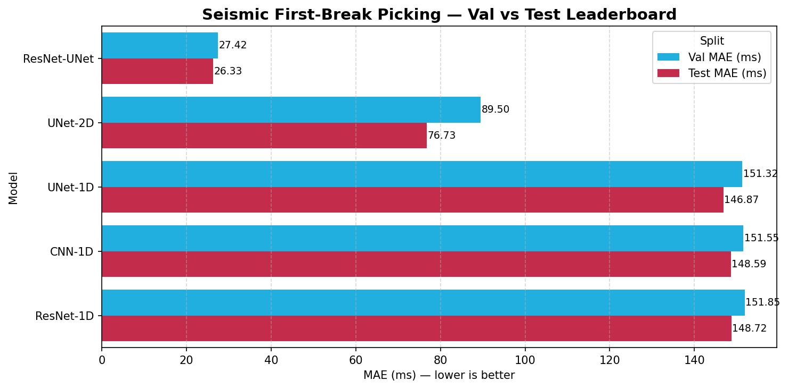

### 13.2 Per-asset validation breakdown from the individual training notebooks

The benchmark notebook exports only aggregate validation and test leaderboards. However, the individual training notebooks contain per-asset **validation** MAE, which is useful for understanding the character of each model.

| Model | Brunswick (val MAE) | Halfmile (val MAE) | Lalor (val MAE) | Sudbury (val MAE) |
| :--- | ---: | ---: | ---: | ---: |
| ResNet-UNet | 35.5 | 16.1 | 19.2 | 23.8 |
| UNet-2D | 138.2 | 108.0 | 52.6 | 45.8 |
| UNet-1D | 174.3 | 117.8 | 132.1 | 218.6 |
| CNN-1D | 265.6 | 197.7 | 100.6 | 68.3 |
| ResNet-1D | 236.0 | 169.6 | 99.8 | 92.5 |

Two patterns are immediately visible:

- the winning ResNet-UNet is not just best on one asset; it is strongest across all four validation splits,
- the 1D models behave inconsistently by asset, but none of them approaches the 2D winner overall.

### 13.3 How to read these numbers relative to the literature

The `26.333 ms` test MAE for the current winner should be interpreted carefully. It is a strong result for a multi-asset, 30-epoch, internally held-out benchmark with no exhaustive hyperparameter search, but it is **not** a direct substitute for published HardPicks numbers because those papers typically report results under the official leave-one-survey-out protocol and often in sample- or pixel-based tolerances.

That means the right conclusion is not "this is state of the art on HardPicks." The right conclusion is: **under the repository's current internal split, gather-level 2D regression models are decisively stronger than the current 1D trace-only neural families, and a pretrained ResNet-UNet is the clear winner.**

---

## 14. Result Analysis and What the Results Mean

### 14.1 The performance gap is large, not marginal

The most important quantitative result in the repository is the size of the 2D versus 1D gap.

- Best 2D model: `26.333 ms` test MAE.
- Best 1D model: `146.866 ms` test MAE.
- Absolute gap: `120.533 ms`.
- Relative reduction: about **82% lower MAE** for the winner.
- Within-10 ms accuracy: `40.84%` for the winner versus `4.88%` for the best 1D model, which is about **8.4x higher**.

Those are not small improvements from tuning. They are evidence that the representation itself matters.

### 14.2 Why the pretrained ResNet-UNet won

The winning model combines four advantages at once:

1. **Gather-level context.** It sees the first-break curve across neighboring traces instead of guessing from one waveform in isolation.
2. **Pretraining.** The encoder starts from a rich feature basis rather than learning edges and boundaries from scratch.
3. **Regression-aligned output.** The Soft-Argmax head predicts one time per trace rather than forcing a brittle hard mask.
4. **Computation amortized across the gather.** One forward pass predicts many traces at once.

The notebook-level per-asset validation results reinforce this explanation. The ResNet-UNet is strongest on Brunswick, Halfmile, Lalor, and Sudbury individually, not just on the aggregate average.

### 14.3 What the training curves say about optimization

The top two models also differ in how they learn.

- In the benchmark notebook, the best ResNet-UNet checkpoint appears at **epoch 27** with validation MAE around `27.4 ms`.
- The best UNet-2D checkpoint appears much earlier, at **epoch 11**, with validation MAE around `89.2 ms`.

That suggests two different stories: the pretrained model keeps improving deep into the 30-epoch budget, while the scratch-trained UNet-2D plateaus much earlier and at a much worse level.

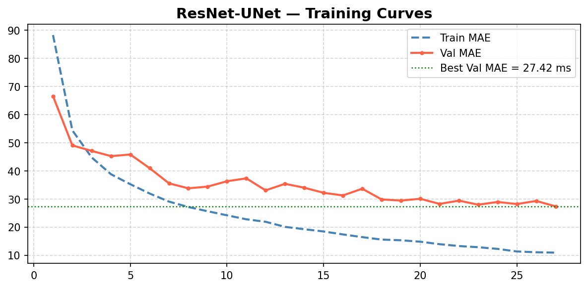

The winning curve shows rapid early improvement followed by a comparatively stable validation regime in the high-20 ms range. That is what good transfer-learning behavior looks like in this setting: the model starts from useful features and spends its budget adapting them to seismic structure rather than learning everything from zero.

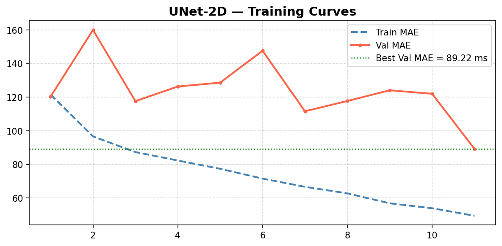

The custom UNet-2D still validates the value of the 2D gather representation, but its optimization is visibly noisier and less efficient. It is not simply a little worse; it is a model that reaches a much higher error floor much earlier under the same epoch budget.

### 14.4 What the error-shape plots add beyond MAE

The next two figures explain *how* the winner is better, not only *how much* better it is.

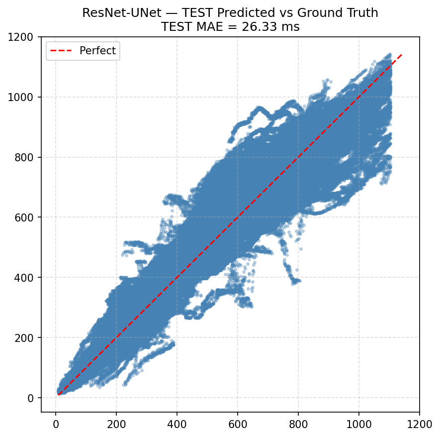

The winner's scatter plot clusters much more tightly around the ideal diagonal than one would expect from the aggregate numbers alone. The pattern is consistent with a model that tracks the physical time axis well rather than only getting the easy early-arrival cases right.

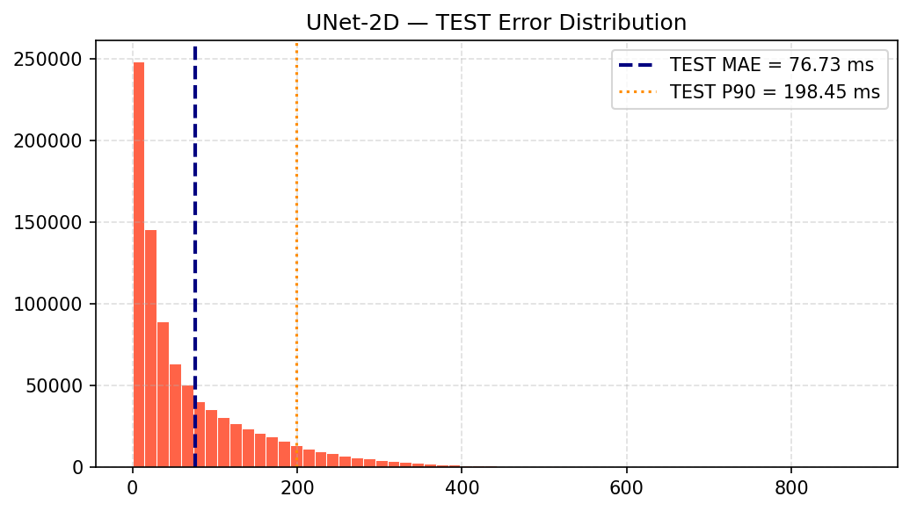

The UNet-2D histogram makes the heavy-tail problem easier to see. The model benefits from the right representation, but it still produces a much larger mass of moderate and large errors than the pretrained winner, which is why its P90 error stays close to `200 ms`.

### 14.5 What the 1D results reveal about representation choice

The 1D models did not fail in the sense of broken training. They trained, converged, and produced stable but mediocre results. The scientific lesson is more interesting: **in this preprocessing regime, single-trace modeling is not enough.**

Three independent 1D families cluster in almost the same range:

- UNet-1D: `146.866 ms` test MAE,
- CNN-1D: `148.593 ms` test MAE,
- ResNet-1D: `148.720 ms` test MAE.

When three different architectures land in nearly the same error band, the limiting factor is usually not tiny architectural detail. It is the information available to the representation. In this case the missing information is obvious:

- no neighboring traces,
- no visible moveout curve,
- no explicit offset input,
- reduced usefulness of absolute amplitude under per-trace normalization.

### 14.6 Asset-level insight from the validation notebooks

The per-asset validation tables suggest a more nuanced story than the aggregate leaderboard alone:

- **Brunswick** is the hardest place for the 1D models. That is consistent with very late arrivals and extremely wide gathers, where cross-trace structure carries a lot of information.
- **Halfmile** is geometrically regular and well labeled, yet the 1D models still lag badly. That supports the claim that geometry alone is not enough; the model must also see the gather context.
- **Lalor** is relatively favorable to all models compared with Brunswick, likely because the arrival is often locally strong even though the survey needed resampling and careful label handling.
- **Sudbury** shows why masking rather than deletion mattered. The winning 2D model remains strong despite the label sparsity, which suggests that preserving unlabeled traces as context was scientifically worthwhile.

### 14.7 How these findings connect to prior work

The benchmark's qualitative conclusions line up well with the literature:

- gather-level modeling beats trace-only modeling, which is exactly what the HardPicks line of work encouraged,
- pretraining helps substantially, consistent with transfer-learning results such as Mardan et al.,
- more geometry-aware architectures are a sensible next step, which matches the direction of DSU-Net and DGL-FB.

What the repository contributes right now is not a new official benchmark record. It is a very clear repository-backed demonstration that representation choice, preprocessing discipline, and transfer learning matter dramatically on this multi-asset problem.

---

## 15. Latency Analysis

### 15.1 Test-time latency ranking

| Rank | Model | Test CPU latency (ms/trace) |
| :--- | :--- | ---: |
| 1 | CNN-1D | 0.0578 |
| 2 | ResNet-1D | 0.0694 |
| 3 | ResNet-UNet | 0.0764 |
| 4 | UNet-2D | 0.1214 |
| 5 | UNet-1D | 0.2021 |

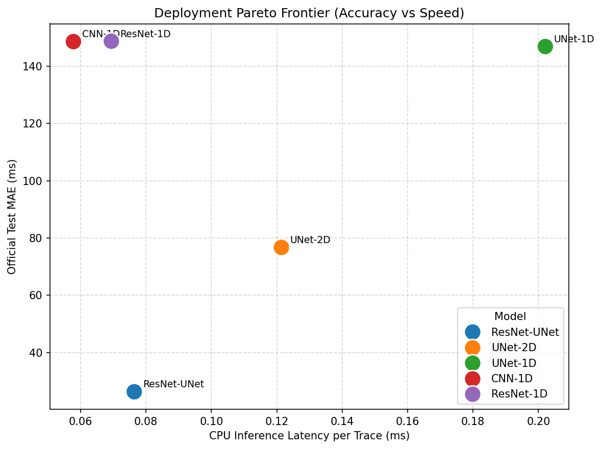

This plot is important because it shows that the most accurate model is not a deployment disaster. The ResNet-UNet sits near the efficient frontier: it is far more accurate than every 1D model while remaining only modestly slower than the faster 1D baselines.

### 15.2 Why latency behaves this way

**CNN-1D is fastest.** It is a compact per-trace model with simple temporal convolutions and no decoder. That makes it cheap, but the speed comes with a large accuracy penalty.

**ResNet-1D is slightly slower.** Residual blocks add compute, but it is still a compact trace-level model.

**ResNet-UNet is surprisingly efficient for a gather model.** Even though it is the largest model by parameter count, it predicts many traces at once. Its cost is amortized across the whole gather, and the pretrained backbone benefits from a highly optimized implementation.

**UNet-2D is slower than the pretrained winner despite fewer parameters.** The custom encoder-decoder still processes wide gathers, but without the same optimization benefits as the pretrained backbone. In the benchmark notebook it is also handled conservatively for memory reasons, which hurts throughput.

**UNet-1D is slowest per trace.** It pays encoder-decoder cost for every individual trace, yet unlike the 2D models it cannot amortize that cost across an entire gather.

### 15.3 The most practical insight

A useful way to summarize the latency story is this:

- ResNet-UNet is only about **32% slower** than ResNet-1D on CPU latency per trace,
- but it delivers about **82% lower** test MAE.

That is an excellent accuracy-efficiency tradeoff. The winner is not only the best scientific model in this benchmark; it is also a realistic deployment candidate.

---

## 16. Limitations and Next Steps

### 16.1 Current limitations

- The current leaderboard is **not** the official HardPicks leave-one-survey-out benchmark.
- The trained models were compared under a **30-epoch** resource budget and should not be assumed fully converged.
- The benchmark notebook exports aggregate validation and test tables; it does not yet export a full per-asset **test** breakdown.
- Statistical significance testing between model pairs has not yet been run.
- The current 1D neural models do not ingest offset explicitly, which limits what conclusions one should draw about 1D modeling in general.
- More advanced search and fine-tuning strategies were not exercised under the current compute budget.

### 16.2 Highest-priority next steps

1. Re-run the benchmark under the official leave-one-survey-out HardPicks protocol.
2. Extend the top two 2D models beyond the 30-epoch budget on stronger hardware.
3. Export per-asset test tables and perform formal statistical comparison.
4. Add explicit offset or other geometric metadata to the 1D neural models.
5. Explore more geometry-aware models, including graph-style or hybrid image-plus-metadata approaches.
6. Add uncertainty analysis for the Soft-Argmax outputs.

The most important reading of the current repository is therefore: **the engineering and scientific direction is sound, but the benchmark story is still incomplete until cross-survey evaluation is added.**

---

## 17. Repository Structure

```text
configs/
  datasets.yaml
  preprocessing.yaml
  model_*.yaml

data/
  raw/
  extracted/
  processed/

notebooks/
  00_environment_setup.ipynb
  01_eda_*.ipynb
  02_preprocessing_pipeline.ipynb
  03_train_*.ipynb
  04_benchmark_and_compare.ipynb

results/
  sanity_plots/
  eda/
  eda_plots/
  benchmark/

artifacts/plots/
  leaderboard/
  ResNet_UNet/
  UNet_2D/
  UNet_1D/
  CNN_1D/
  ResNet_1D/

src/
  data/
  evaluation/
  features/
  models/
  training/
  utils/
```

### Most important implementation files

- `src/data/shot_gather_builder.py`: preprocessing, label validation, harmonization, and split generation.
- `src/data/dataset.py`: dataset wrappers, collate functions, balanced sampling, and progressive sampling.
- `src/data/transforms.py`: physically plausible training-time augmentations.
- `src/models/unet.py`: 2D SoftArgmax U-Net and pretrained ResNet-UNet.
- `src/models/unet_1d.py`: 1D SoftArgmax U-Net.
- `src/models/cnn_1d.py`: CNN-1D, ResNet-1D, and other temporal baselines.
- `src/features/features.py`: handcrafted feature extraction for tabular experiments.
- `src/training/trainer.py`: masked training loop, AMP, clipping, checkpointing, and evaluation hooks.
- `src/training/mlflow_logger.py`: experiment logging and artifact tracking.

---

## 18. References

St-Charles, P.-L., Rousseau, B., Ghosn, J., Bellefleur, G., & Schetselaar, E. (2024). *A deep learning benchmark for first break detection from hardrock seismic reflection data*. Geophysics, 89(1), WA279-WA294.

St-Charles, P.-L., Rousseau, B., Ghosn, J., Bellefleur, G., & Schetselaar, E. (2021). *A multi-survey dataset and benchmark for first break picking in hard rock seismic exploration*. NeurIPS 2021 Workshop on Machine Learning for the Physical Sciences.

mila-iqia. (2026). *hardpicks: Deep learning dataset and benchmark for first-break detection from hardrock seismic reflection data*. GitHub repository. https://github.com/mila-iqia/hardpicks

Mardan, A., Blouin, M., & Giroux, B. (2024). *A fine-tuning workflow for automatic first-break picking with deep learning*. Near Surface Geophysics, 22(5), 539-552.

Zwartjes, P., & Yoo, J. (2022). *First break picking with deep learning - evaluation of network architectures*. Geophysical Prospecting, 70(2), 318-342.

Wang, H., Feng, R., Wu, L., Liu, M., Cui, Y., Zhang, C., & Guo, Z. (2024). *DSU-Net: Dynamic Snake U-Net for 2-D Seismic First Break Picking*. IEEE Transactions on Geoscience and Remote Sensing, 62.

Wang, H., Long, L., Zhang, J., Wei, X., Zhang, C., & Guo, Z. (2024). *DGL-FB: Seismic First Break Picking in a Higher Dimension Using Deep Graph Learning*. arXiv:2404.08408.

Bellefleur, G., Schetselaar, E., White, D., Miah, K., & Dueck, P. (2015). *3D seismic imaging of the Lalor volcanogenic sulphide deposit, Manitoba, Canada*. Geophysical Prospecting, 63, 813-832.

Malehmir, A., & Bellefleur, G. (2009). *3D seismic reflection imaging of volcanic-hosted massive sulfide deposits: Insights from reprocessing Halfmile Lake data, New Brunswick, Canada*. Geophysics, 74(6), B209-B219.

Adam, E., Perron, G., Milkereit, B., Wu, J., Calvert, A. J., Salisbury, M., Verpaelst, P., & Dion, D. J. (2000). *A review of high-resolution seismic profiling across the Sudbury, Selbaie, Noranda, and Matagami mining camps*. Canadian Journal of Earth Sciences, 37(2-3), 503-516.

Wolpert, D. H., & Macready, W. G. (1997). *No free lunch theorems for optimization*. IEEE Transactions on Evolutionary Computation, 1(1), 67-82.

Akaike, H. (1974). *A new look at the statistical model identification*. IEEE Transactions on Automatic Control, 19(6), 716-723.

Allen, R. V. (1978). *Automatic earthquake recognition and timing from single traces*. Bulletin of the Seismological Society of America, 68, 1521-1532.

Allen, R. V. (1982). *Automatic phase pickers: Their present use and future prospects*. Bulletin of the Seismological Society of America, 72(6B), S225-S242.

Sabbione, J. I., & Velis, D. (2010). *Automatic first-breaks picking: New strategies and algorithms*. Geophysics, 75(4), V67-V76.
